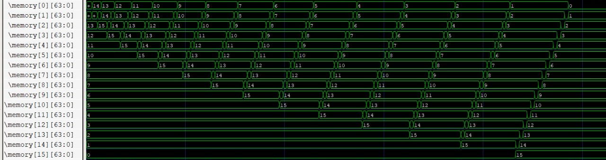

# tp03-3869-3872-3882

## Integrantes do grupo

1. Dener Vieira Ribeiro - 3872
2. Germano Barcelos dos Santos - 3873

## Caminho de dados do RISC-V com Pipeline

Na imagem abaixo é apresentado o resultado do algoritmo de Insertion Sort no caminho de dados do risc-v com pipeline.



## Algoritmo utilizado no exemplo acima

```c
int N = 16;
int v[N];
int i, j, temp;

for(i=1; i<N; i++) {
    for(j=i; j > 0 && v[j] < v[j-1]; j--) {
        temp = v[j];
        v[j] = v[j-1];
        v[j-1] = temp;
    }
}
```

Para converter esse belo código para assembly, utilizamos os seguintes registradores para as variáveis:

* N = x10
* v = x11
* i = x5
* j = x6

E esse aqui é o código em assemby do algoritmo utilizado, o Bubble Sort. Confira o final, tem informações importantes lá.

```asm
start:
    add x5, x0, x0
    
    sub x28, x10, x1
    sub x28, x28, x1
    sub x28, x28, x5
    and x28, x28, x3
    beq x28, x0, forI

    beq x0, x0, exit

forI:
    add x6, x5, x1

forJ:
    sub x7, x6, x1
    add x31, x7, x7
    add x31, x31, x31
    add x31, x31, x31
    add x31, x31, x11

    ld x18, 0(x31)
    ld x19, 8(x31)    

    sub x28, x18, x19
    sub x28, x28, x1
    and x28, x28, x3
    beq x28, x0, swap

swapReturn:
    sub x6, x6, x1
    sub x28, x6, x1
    and x28, x28, x3
    beq x28, x0, forJ


    add x5, x5, x1
    sub x28, x10, x1
    sub x28, x28, x1
    sub x28, x28, x5
    and x28, x28, x3
    beq x28, x0, forI

exit:
    beq x0, x0, exit

swap:
    sd x18, 8(x31)
    sd x19, 0(x31)
    beq x0, x0, swapReturn
```

### Observações

1. Nenhuma das instruções solicotadas nos permitia fazer operações com valores diretamente via código, então alguns valores precisaram ser inicializados nos registradores e memória para o bom funcionamento desse exemplo. Esses valores podem ser acessados por [aqui](./src/inputs).  

    * O registrador x1 deve ser inicializado com o valor 1.
    * O registrador x3 deve ser inicialixado com o valor (1<<63), o menor valor negativo em complemento de dois com 64 bits.
    * Adicione os valores na memória de dados.